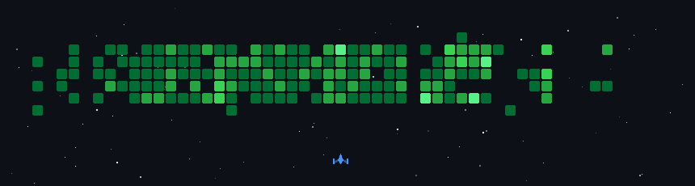

# Hi, I'm Saina 👋

### 🎮 Visuals & Contributions

  

---

### 📊 Git Status & Most Used Stacks

  <!-- General GitHub Stats Card -->
  &show_icons=true&theme=visual_studio_code&hide_border=true" alt="Saina's GitHub stats" width="48%" />
  
  <!-- Automatically generated Most Used Languages/Stacks Card -->
  &layout=compact&theme=visual_studio_code&hide_border=true" alt="Saina's Top Stacks" width="48%" />

<h1 align="center">Hi 👋, I'm <Saina></h1>

  <em><YOUR_TAGLINE — e.g. "Full-stack developerr"></em>

---

## 🚀 My contributions, as a space shooter

  

---

## 🧑‍💻 About me

- 🔭 I'm currently working on **<WHAT YOU'RE BUILDING>**
- 🌱 I'm currently learning **<WHAT YOU'RE LEARNING>**
- 💬 Ask me about **<TOPICS>**
- 📫 How to reach me: **<EMAIL / LINK>**

## 🛠️ Tech I work with

<!-- Replace with your own badges -->

## 📊 GitHub stats

  &show_icons=true&hide_border=true" alt="GitHub stats" />

